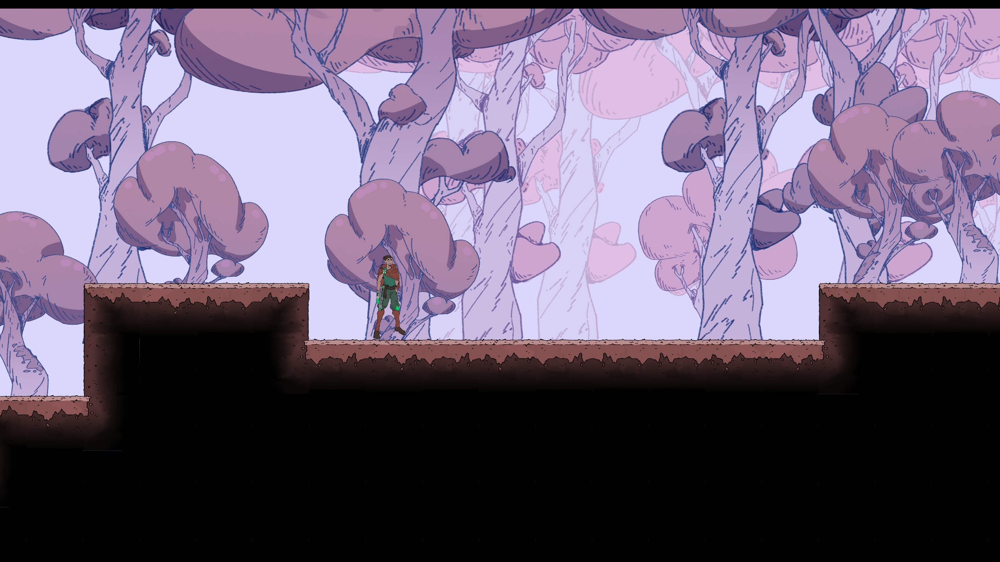

# Sweet Dream
A sweet video game in the style of a metroidvania where you explore a candy world

## Development
This game is still in development, if you want to help with playtesting, programming, art, music or sound effects, you can join our [discord](https://discord.gg/Z7xxwh9mGB).
## Open source
This game was made (mostly) using open source software and is also open source. The code was written on Linux and there is planned support for Linux, Mac, and Windows on release. 
## Tools
- [Godot engine](https://godotengine.org/download)
- [Sprite sheet generator](https://github.com/kcnqwe/SpriteSheetGenerator)
- [Ardour](https://community.ardour.org/download)
- [Adobe photoshop](https://www.adobe.com/creativecloud/plans.html?plan=individual&filter=all&promoid=PYPVPZQK&mv=other)
- [Adobe animate](https://www.adobe.com/creativecloud/plans.html?plan=individual&filter=all&promoid=PYPVPZQK&mv=other)
